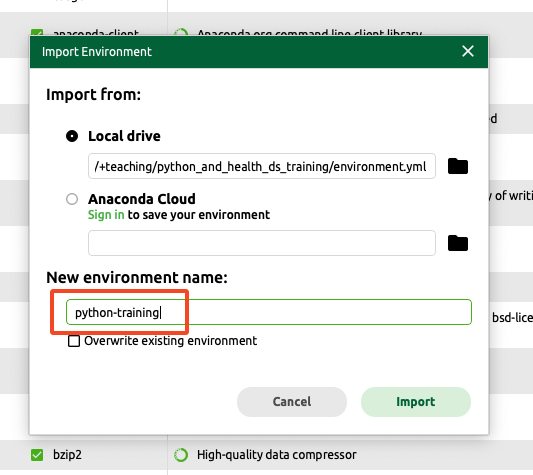

# Pre-course installation guide

This guide will help you set up the working environment (a conda virtual environment) for this project.

The main steps are:
1. Save the environment file
2. Install a conda distribution
3. Create the conda environment
4. (Optional: Only for Day 3) Setup Google Colab

If you have trouble with the steps, please carefully read the guide on the relevant pages (e.g. steps which might defer depending on your operating system).
You could also come to the drop-in session.

**Drop-in Session:** 13:00 - 14:00, Friday, 1 Nov, at OS6, Oakfield House, BS8 2BN

# Step 1: Save the environment file

If you do not know how to use git and git repositories, you should save the link below to your computer in a directory / folder where you want to use as the working directory (e.g. `~/Downloads`) and save it as "environment.yml".

https://github.com/MRCIEU/python_and_health_ds_training/raw/refs/heads/main/environment.yml

If you have already known how to work with git repositories, you could also clone this repository locally and use the local environment.yml file there.

# Step 2: Install a conda distribution

You should then install a "conda distribution" (i.e. anaconda or miniconda), via the command line **or** using a graphical tool. If you already have conda installed in your system, you can skip to the next step.

## Using graphical tool (Anaconda Navigator)

If you prefer a graphical tool, you can download and install anaconda from here https://www.anaconda.com/download and follow the official instruction steps (note: you can skip the registration). We recommend people on **Windows** to use this approach.

If the installation is successful, you should be able to find and launch the Anaconda Navigator (see below) from your operating system.


The following resources might be useful for using the Navigator tool:
- https://docs.anaconda.com/navigator/
- https://s4.ad.brown.edu/python2020/software.html
- https://www.lancaster.ac.uk/staff/drummonn/PHYS281/demo-anaconda/

## Using command line (miniconda)

You should download miniconda from this page https://docs.anaconda.com/miniconda/ and install it in a terminal.

# Step 3: Create the conda environment

## Using Graphical tool

As shown in the figure below, go to the "Environments" tab (<span style="color:blue">blue</span>) in Navigator
and select "Import" (<span style="color:red">red</span>) and load the environment.yml file saved in Step 1. You could choose to rename the environment to "python-training" or other names (optional).

If your installation is successful, you should be able to see the "python-training" name appear (<span style="color:green">green</span>).




## Using command line

If miniconda has been successfully installed, open a new terminal session and check if the command `which conda` produces no errors.

Change the working directory (e.g. `cd`) to where you have put the downloaded environment.yml file. 
Then run the following to create the conda environment for this course.

```
conda env create -f environment.yml
```

If your installation is successful, use the following command to activate the environment when you are working with the materials of this course

```
conda activate python-training
```

# Step 4: Setup Google Colab (For students enrolled in day-3 training)

To use Google Colab, you will need a Google Account. If you do not have one, please create an account following https://support.google.com/mail/answer/56256?hl=en-GB#

If you have a Google account, go to https://colab.research.google.com/ and you should see the following page.


---

If you have completed the above steps, you should be good to go.
